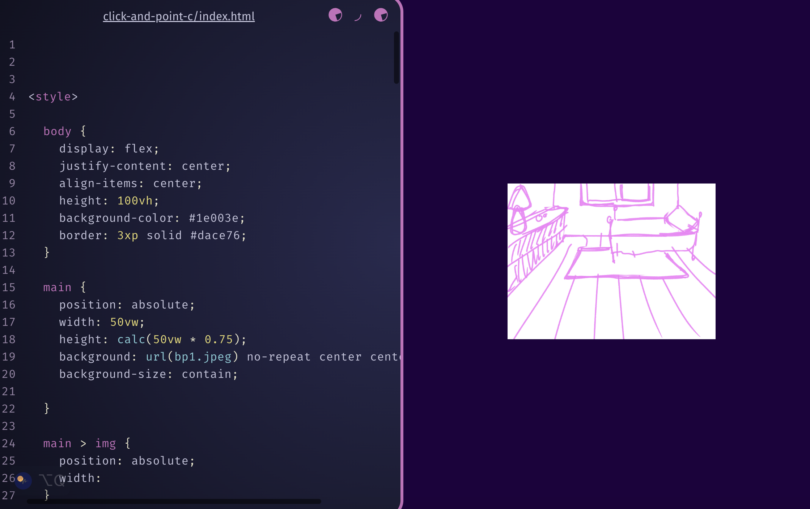

# click-and-point-c

This is the third and final viewport for this Click and Point project. It is still a work in progress, but it has a screen the is receptive to the size of the screen that it is on. I also has arrays with background images and images that will be converted into button.
